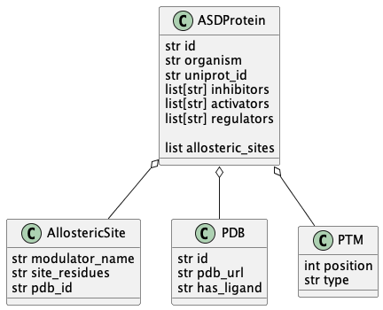

# ASDParser

ASDParser provides a single parser for Allosteric Database ASD

```
Qiancheng Shen, Guanqiao Wang, Shuai Li, Xinyi Liu, Shaoyong Lu, Zhongjie Chen, Kun Song, Junhao Yan, Lv Geng, Zhimin Huang, Wenkang Huang, Guoqiang Chen, Jian Zhang, 
ASD v3.0: unraveling allosteric regulation with structural mechanisms and biological networks, Nucleic Acids Research, Volume 44, Issue D1, 4 January 2016, Pages D527–D535, 
https://doi.org/10.1093/nar/gkv902
```

This python wrapper allow to retrieve the database easily as python dataclasses as well as provide simple utility functions for panda dataframe that allow to explor and filter intersting subsets of the database.


## Installation

ASDPaser is generally distributed using pypi and can install using pip, as follow:

```
pip install --upgrade ASDParser
```

## Usage

Allosteric database (ASD) need to be dowloaded under the local file system, intructions for dowload are available under the [ASD project](http://mdl.shsmu.edu.cn/ASD/module/download/download.jsp?tabIndex=1).


```
import pandas as pd
from asdparser.asd import AsdDB

db = AsdDB(db_directory)
```

Retrieve a specific item

```
db.get('ASD01140000_19')
```

Database properties in panda frames:

```
db.to_df()
```

## Data dictionary

The following python dataclasses are available.

